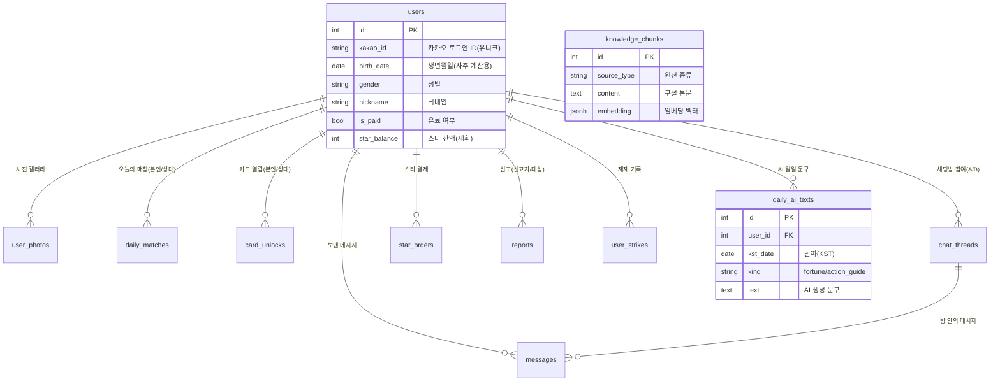

# ZAMI 데이터베이스 스키마 문서

> 사주·별자리 기반 인연 매칭 플랫폼 **ZAMI**의 데이터베이스 구조를 정리한 문서입니다.
> 누구나 이해할 수 있도록 "이 표에 무엇이 왜 저장되는지"를 쉬운 말로 설명합니다.

| 항목 | 내용 |
|---|---|
| **DB 종류** | PostgreSQL 17.6 (Supabase) |
| **연결 방식** | Session Pooler (`aws-1-ap-northeast-2.pooler.supabase.com`) |
| **스키마 출처** | 백엔드 SQLAlchemy 모델 (`backend/app/models/`) → 서버 시작 시 자동 생성 |
| **마이그레이션** | Alembic 없음. 새 컬럼은 `database._DEV_COLUMNS`에 추가 → `ALTER TABLE ADD COLUMN IF NOT EXISTS` |
| **테이블 수** | 11개 (모두 `public` 스키마) |
| **작성 기준일** | 2026-06-07 (라이브 DB 실측) |

---

## 1. 한눈에 보는 전체 구조 (ERD)

`users`(사용자)가 **중심 허브**이고, 거의 모든 표가 `users`를 가리킵니다.
`knowledge_chunks`(사주 원전)만 독립적으로 존재합니다.

### 관계 한 줄 요약
- **1명의 사용자** ↔ 여러 개의 사진·매칭·열람기록·채팅·결제·신고·제재·AI문구 (전부 `1:N`)
- **1개의 채팅방** ↔ 여러 개의 메시지 (`1:N`)
- 모든 외래키(FK)는 `users.id`를 향함 (단, `messages.thread_id`만 `chat_threads`를 향함)
- ⚠️ FK에 `ON DELETE CASCADE`가 **없음** → 회원 탈퇴 시 DB가 자동으로 안 지움. 앱 코드(`services/users.delete_account`)가 직접 정리.

---

## 2. 테이블별 상세

각 표마다 **무엇을 위한 표인지 → 컬럼별 의미 → 규칙(제약)** 순서로 설명합니다.

---

### 👤 `users` — 사용자 (중심 표)

회원 1명 = 1행. 사주 입력값, 프로필, 재화(스타)가 한 표에 모여 있습니다.

| 컬럼 | 타입 | 의미 / 저장 내용 |
|---|---|---|
| `id` | int (PK) | 사용자 고유 번호 |
| `kakao_id` | varchar (유니크) | 카카오 로그인 식별자. 같은 카카오 계정은 1개만 |
| `birth_date` | date | 생년월일 — **사주 계산의 핵심 입력** |
| `birth_time` | varchar(5) | 태어난 시각 `"HH:MM"` (모르면 비움) |
| `calendar_type` | varchar(10) | 양력/음력 (`solar`/`lunar`) |
| `is_leap_month` | bool | 음력 윤달 여부 |
| `gender` | varchar(10) | 성별 (`male`/`female`) |
| `birth_place` | varchar(50) | 출생 지역 |
| `nickname` | varchar(50) | 표시 이름 |
| `photo_url` | varchar(512) | 대표 사진 URL (매칭카드·채팅헤더용) |
| `bio` | varchar(120) | 한 줄 소개 |
| `height_cm` | int | 키 |
| `mbti` | varchar(4) | MBTI |
| `job` | varchar(50) | 직업 |
| `region` | varchar(50) | 활동 지역 |
| `smoking` | varchar(20) | 흡연 여부 |
| `drinking` | varchar(20) | 음주 여부 |
| `religion` | varchar(20) | 종교 |
| `is_paid` | bool | 유료 사용자 여부 (무료는 상대 사진 블라인드) |
| `star_balance` | int | **스타 잔액**. 인연 카드 추가 열람 시 10개씩 차감 |
| `chat_suspended_until` | timestamptz | 채팅 정지 해제 시각 (제재) |
| `created_at` / `updated_at` | timestamptz | 가입·수정 시각 |

**규칙:** `kakao_id` 유니크 인덱스.

---

### 📚 `knowledge_chunks` — 사주 원전 (RAG 지식)

AI가 사주 풀이를 할 때 **근거로 인용하는 고전 문헌 조각**들입니다. (적천수천미·궁통보감·자미두수전서 등)

| 컬럼 | 타입 | 의미 / 저장 내용 |
|---|---|---|
| `id` | int (PK) | 조각 번호 |
| `source_type` | varchar(50) | 원전 종류 |
| `source_title` | varchar(255) | 책 제목 |
| `source_author` | varchar(100) | 저자 |
| `topic` / `chapter` / `section` | varchar | 주제·장·절 분류 |
| `chunk_index` | int | 같은 출처 내 조각 순서 |
| `content` | text | 구절 본문 (검색·인용에 사용) |
| `content_original` | text | 원문(한문 원본) |
| `content_hash` | varchar(64) (유니크) | 본문 해시 — **중복 적재 방지** |
| `language` | varchar(10) | 언어 코드 |
| `tags` | jsonb | 분류 태그 |
| `embedding` | jsonb | **의미 검색용 벡터** (숫자 배열) |
| `embedding_model` | varchar(100) | 임베딩 생성 모델명 |

**규칙:** `content_hash` 유니크. 인덱스: source_type, topic, (source_type+topic).

---

### 🃏 `daily_matches` — 오늘의 매칭 (4슬롯 방식)

하루치 매칭 후보 묶음. 한 사이클 = 4장(슬롯 0~3)이 같은 시각에 배정됩니다.

| 컬럼 | 타입 | 의미 / 저장 내용 |
|---|---|---|
| `id` | int (PK) | 행 번호 |
| `user_id` | int (FK→users) | 이 매칭을 받는 사람 |
| `candidate_id` | int (FK→users) | 추천된 상대 |
| `slot_index` | int | 슬롯 위치 (0~3) |
| `assigned_at` | timestamptz | 배정 시각 (사이클 기준점) |

**규칙:** 인덱스 `(user_id, assigned_at)`로 사이클 단위 조회.

---

### 🔓 `card_unlocks` — 인연 카드 열람 기록 (신 방식)

"이 사람이 이 상대 카드를 열었다"를 기록. 채팅 가능 여부·재추천 방지·과금의 근거.

| 컬럼 | 타입 | 의미 / 저장 내용 |
|---|---|---|
| `id` | int (PK) | 행 번호 |
| `user_id` | int (FK→users) | 카드를 연 사람 |
| `candidate_id` | int (FK→users) | 열람된 상대 |
| `kind` | varchar(10) | `daily`(무료 1장) / `extra`(스타 10개 차감) |
| `unlocked_at` | timestamptz | 열람 시각 |

**규칙:** **UNIQUE(user_id, candidate_id)** — 같은 상대를 두 번 과금하지 않음.

---

### 🤖 `daily_ai_texts` — AI 일일 문구 캐시

오늘의 인연운/행동가이드를 LLM이 생성한 결과를 **하루 단위로 저장**. 같은 날 재요청 시 LLM을 다시 부르지 않아 비용을 아낍니다.

| 컬럼 | 타입 | 의미 / 저장 내용 |
|---|---|---|
| `id` | int (PK) | 행 번호 |
| `user_id` | int (FK→users) | 대상 사용자 |
| `kst_date` | date | 한국시간 기준 날짜 |
| `kind` | varchar(20) | `fortune`(인연운) / `action_guide`(행동가이드) |
| `text` | text | AI가 생성한 한국어 문구 |
| `created_at` | timestamptz | 생성 시각 |

**규칙:** **UNIQUE(user_id, kst_date, kind)** — 하루·종류당 1행.

---

### 💬 `chat_threads` / `messages` — 채팅

| `chat_threads` 컬럼 | 의미 |
|---|---|
| `id` (PK) | 채팅방 번호 |
| `user_a_id` / `user_b_id` (FK→users) | 두 참여자 |
| `user_a_last_read_id` / `user_b_last_read_id` | 각자 마지막으로 읽은 메시지 id (안 읽음 카운트용) |
| `user_a_left` / `user_b_left` | 각자 방 나갔는지 |
| `created_at` / `updated_at` | 생성·갱신 시각 |

**규칙:** UNIQUE(user_a_id, user_b_id) — 한 쌍당 방 1개.

| `messages` 컬럼 | 의미 |
|---|---|
| `id` (PK) | 메시지 번호 |
| `thread_id` (FK→chat_threads) | 속한 방 |
| `sender_id` (FK→users) | 보낸 사람 |
| `content` | 본문 텍스트 |
| `media_url` / `media_type` | 사진 등 첨부 |
| `created_at` | 보낸 시각 |

**규칙:** 인덱스 `(thread_id, id)`로 방 안 메시지 순차 조회.

---

### 💳 `star_orders` — 스타 결제 (토스페이먼츠)

스타 충전 주문 기록. 2단계(주문 생성 → 결제 승인)로 진행됩니다.

| 컬럼 | 타입 | 의미 / 저장 내용 |
|---|---|---|
| `id` (PK) | int | 주문 번호 |
| `user_id` (FK→users) | int | 결제한 사람 |
| `order_id` | varchar(64) (유니크) | 우리가 발급한 주문번호 (토스에 전달) |
| `product_id` | varchar(20) | 상품 ID (`STAR-001`~`004`) |
| `amount` | int | 결제 금액(원) |
| `star_amount` | int | 지급할 스타 수 |
| `status` | varchar(20) | `PENDING`/`PAID`/`FAILED` |
| `payment_key` | varchar(200) (유니크) | 토스 승인 키 — **중복 적립 차단** |
| `created_at` / `paid_at` | timestamptz | 주문·결제완료 시각 |

> 금액·스타 매핑은 **서버 카탈로그가 결정** (클라이언트가 보낸 금액 불신 → 위변조 차단).

---

### 📷 `user_photos` — 사진 갤러리

대표 사진(`users.photo_url`) 외에 최대 6장까지 올리는 갤러리.

| 컬럼 | 타입 | 의미 / 저장 내용 |
|---|---|---|
| `id` (PK) | int | 사진 번호 |
| `user_id` (FK→users) | int | 주인 |
| `url` | varchar(512) | Cloudinary 이미지 URL |
| `public_id` | varchar(256) | Cloudinary 식별자 (삭제 시 필요) |
| `position` | int | 표시 순서 (0=첫번째) |
| `is_primary` | bool | 대표 사진 여부 (1인당 1장) |
| `is_face_verified` | bool | AWS 얼굴 인증 통과 여부 → **ZAMI 공식 인증 뱃지** |
| `created_at` | timestamptz | 업로드 시각 |

---

### 🚨 `reports` / `user_strikes` — 신고 · 제재

| `reports` 컬럼 | 의미 |
|---|---|
| `id` (PK) | 신고 번호 |
| `reporter_id` (FK→users) | 신고한 사람 |
| `reported_id` (FK→users) | 신고당한 사람 |
| `reason` | 신고 사유 |
| `details` | 자유 서술("기타" 사유) |
| `created_at` | 신고 시각 |

| `user_strikes` 컬럼 | 의미 |
|---|---|
| `id` (PK) | 제재 번호 |
| `user_id` (FK→users) | 제재 대상 |
| `kind` | 제재 종류 |
| `detail` | 상세 사유 |
| `created_at` | 제재 시각 |

---

## 3. 현재 데이터 현황 (2026-06-07 실측)

| 테이블 | 행수 | 비고 |
|---|---|---|
| `users` | 14 | 전원 `is_paid=true`, `star_balance=0` (시드 유저). 남 8 / 여 6, 전부 양력 |
| `knowledge_chunks` | 480 | RAG 원전. `language`가 **전부 `zh`(한문)** |
| `daily_matches` | 46 | 슬롯 0~3 고르게 분포 |
| `daily_ai_texts` | 2 | AI 캐시 정상 작동 (인연운 + 행동가이드) |
| `card_unlocks` | 1 | `kind='daily'` 1건 |
| `chat_threads` · `messages` | 0 · 0 | 채팅 아직 미사용 |
| `star_orders` | 0 | 결제 아직 미사용 |
| `user_photos` | 0 | 사진 아직 미사용 |
| `reports` · `user_strikes` | 0 · 0 | 신고·제재 아직 미사용 |

---

## 4. ⚠️ 알아둘 점 & 정리 후보

1. **매칭이 두 시스템으로 갈려 있음** — `daily_matches`(옛 4슬롯, 46행)와 `card_unlocks`(신 열람기록, 1행)가 공존합니다. 코드에도 `compatibility.py`의 4슬롯 방식과 `matching.py`의 신 방식이 둘 다 살아있어요. **→ 통합·정리 후보** (어느 쪽을 정식으로 둘지 결정 필요).

2. **`knowledge_chunks.language`가 전부 `zh`** — 모델 기본값은 `ko`인데 실제 데이터는 한문(`zh`)으로 적재돼 있습니다. (`content`=번역, `content_original`=한문 원본 구조일 가능성)

3. **`embedding`이 `jsonb` (pgvector 아님)** — 벡터 유사도 검색을 DB가 아니라 앱에서 계산. 데이터가 커지면 성능 이슈 가능 → 추후 pgvector 전환 검토.

4. **FK에 CASCADE 없음** — 탈퇴 처리는 반드시 앱 레이어(`delete_account`)에서 수동으로. DB만 믿으면 고아 데이터 발생.

5. **실사용 테이블은 4개뿐** (`users`·`knowledge_chunks`·`daily_matches`·`daily_ai_texts`) — 채팅/결제/사진/신고는 아직 데이터 0 (초기 단계).
